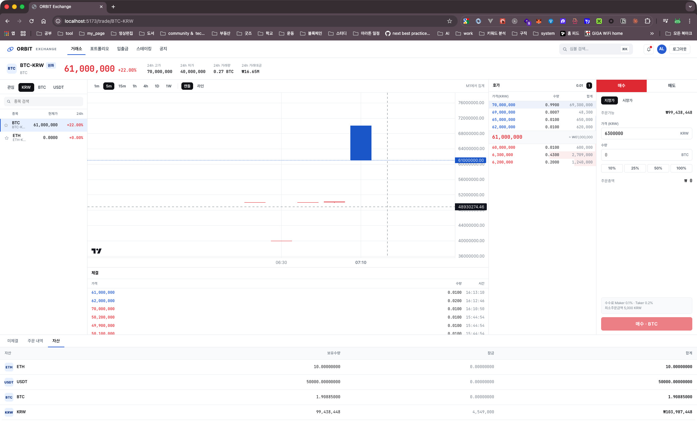

# ORBIT Exchange

프로덕션 지향으로 설계한 학습용 스팟 암호화폐 거래소.
HTTP API · 매칭엔진 · WebSocket 게이트웨이 · 백그라운드 워커가 **각자의 프로세스**로 분리되어 Kafka command/event 토폴로지 위에서 동작합니다 (Phase 1 — TypeScript). 자체 매칭엔진은 npm 패키지 [`orderbook-match-engine`](https://www.npmjs.com/package/orderbook-match-engine) v2를 그대로 사용하고, AWS(S3 / SNS / SQS / Secrets Manager)는 LocalStack으로 로컬 에뮬레이트합니다.



- **시스템 설계**: [SYSTEM_DESIGN.md](./SYSTEM_DESIGN.md)
- **UI 디자인**: [Claude Design · ORBIT Exchange](https://claude.ai/design/p/38eb67ef-e881-468a-a0aa-4358fc5d317d?via=share&file=ORBIT+Exchange.html)
  — Claude Design에서 만든 라이트테마 핀테크 시안. JSX 원본은 [design/](./design) 디렉토리에 함께 커밋되어 있고,
  `apps/web` 은 그 토큰/레이아웃을 TypeScript로 이식한 구현입니다.

```
apps/
  api/        NestJS — HTTP only (auth · 잔고 락 · 주문 생성 → Kafka command 발행)   :3000
  matcher/    NestJS standalone — Kafka command 컨슘 → in-memory book → 정산 트랜잭션
  realtime/   NestJS — Socket.IO 게이트웨이 (Redis pub/sub 구독, 스냅샷 캐시 read)   :3001
  workers/    NestJS — Kafka consumer들 (candle / WS fanout / SNS / S3 audit)
  web/        Vite + React — 라이트 테마 트레이딩 뷰 (디자인: design/*)             :5173
packages/
  shared/     공용 DTO / 이벤트 스키마 / Kafka topic·Redis key 상수
infra/
  localstack/bootstrap.sh   S3 / SNS / SQS / Kafka 토픽 시드
```

### 토폴로지 (Phase 1 — TS 분리 완료)

```
            ┌─────────────────── Browser (React) ───────────────────┐
            │  REST  /api → :3000          WS  /socket.io → :3001   │
            └──────────┬────────────────────────────┬───────────────┘
                       │                            │
                       ▼                            ▼
              ┌──────────────────┐         ┌──────────────────┐
              │   apps/api       │         │  apps/realtime   │
              │  (HTTP, stateless)│         │ (Socket.IO only) │
              │  • lock+create    │         │ • snapshot read  │
              │  • publish CMD    │         │ • Redis psub     │
              └──────┬───────────┘         └────────▲─────────┘
                     │ Kafka                        │ Redis pub/sub (md:*)
                     │ orbit.order-commands.v1      │   + ob:snapshot:* (SET)
                     ▼                              │
              ┌──────────────────┐  Kafka events    │
              │  apps/matcher    │──────────────────┤
              │ • in-memory book │ trades/orders/   │
              │ • per-market PQ  │ orderbook/user-  │
              │ • settle in TX   │ events           │
              └──────┬───────────┘                  │
                     │                              │
            ┌────────┴───────┐               ┌──────┴──────┐
            ▼                ▼               ▼             ▼
        Postgres        Kafka topics    apps/workers   (S3 / SNS)
       (orders,      (orbit.*.v1)      (candle/fanout/
        trades,                        notify/audit)
        wallets)
```

수평 확장 모델: `api` / `realtime` / `workers`는 stateless → 다중 replica 가능. `matcher`는 마켓 단위 owner이므로 **마켓 샤딩(consumer group + 파티션 키)** 으로만 확장 (단일 프로세스 = 단일 in-memory book).

---

## 0. 사전 요구사항

| | 버전 | 확인 |
|---|---|---|
| Docker Desktop | running | `docker info` |
| Node.js | ≥ 20 (권장 24) | `node -v` |
| pnpm | ≥ 10 | `corepack enable && corepack use pnpm@10` |
| AWS CLI | 최신 | `aws --version` (LocalStack 부트스트랩용) |

---

## 1. 원클릭 세업 (최초 1회)

```bash
pnpm setup
```

내부적으로 다음이 순차 실행됩니다:

1. `pnpm install` — 전 워크스페이스 의존성 설치
2. `shared:build` — `packages/shared` 빌드 (api / matcher / realtime / workers 가 import 하는 공용 타입·상수)
3. `infra:up` — Docker 컨테이너 4개 기동 (postgres / redis / redpanda / localstack)
4. `infra:wait` — 전 컨테이너 `healthy` 될 때까지 대기
5. `infra:bootstrap` — LocalStack에 S3 버킷, SNS 토픽, SQS 큐, Kafka 토픽 생성
6. `db:migrate` — Prisma 마이그레이션
7. `db:seed` — 자산/마켓 + 데모 계정 2개(alice, bob) 시드

> 처음 받는 Docker 이미지가 ~500MB 이므로 첫 실행은 수 분 걸릴 수 있습니다.

---

## 2. 개발 서버 실행

```bash
pnpm dev
```

한 터미널에서 **api · matcher · realtime · workers · web** 이 병렬로 기동됩니다.

기동이 끝나면:

| 용도 | URL |
|---|---|
| 프론트엔드 (Vite) | http://localhost:5173 |
| API (HTTP) | http://localhost:3000/api/v1/health |
| Realtime (WS + health) | http://localhost:3001/health |
| Redpanda Console (Kafka UI) | http://localhost:8080 |
| LocalStack | http://localhost:4566 |

> Matcher는 HTTP를 노출하지 않습니다 (Kafka command 컨슈머 전용). 헬스체크는 로그의 `matching engines ready: <markets>` / `subscribed to orbit.order-commands.v1` 로 확인.

### 개별 실행 (선호하는 경우)

```bash
pnpm dev:api       # HTTP API           :3000
pnpm dev:matcher   # 매칭/정산 워커      (no port)
pnpm dev:realtime  # Socket.IO 게이트웨이 :3001
pnpm dev:workers   # Kafka consumers
pnpm dev:web       # vite               :5173
```

---

## 3. 데모 계정 & 빠른 체결 시나리오

시드된 계정 (둘 다 비밀번호 `orbit1234!`):

| 이메일 | 초기 잔고 |
|---|---|
| alice@orbit.dev | KRW 1억, BTC 2, ETH 10, USDT 50,000 |
| bob@orbit.dev   | KRW 1억, BTC 2, ETH 10, USDT 50,000 |

체결을 바로 보고 싶다면 브라우저 2개(또는 시크릿창)로 같이 접속:

1. **alice** 로그인 → `BTC-KRW` 트레이딩 뷰 → 매도 지정가 `50,000,000 KRW × 0.1 BTC`
2. **bob** 로그인 → 같은 마켓에서 매수 지정가 `50,000,000 × 0.06`
3. 좌측 호가창 / 차트 / 체결 테이프 / 하단 미체결 탭이 실시간 갱신됨

내부 흐름:

```
api (POST /orders)
  └─ 잔고 lock + Order(OPEN) 생성 (한 트랜잭션)
  └─ Kafka publish → orbit.order-commands.v1  [key=symbol]
                              │
                              ▼
matcher (consumer group orbit.matcher)
  └─ per-market p-queue → orderbook.add()  → trades 산출
  └─ 정산 트랜잭션 (지갑 update + Trade row + Order status)
  └─ Kafka publish → orbit.{trades,orders,orderbook,user-events}.v1
  └─ Redis SET     → ob:snapshot:<symbol>  (TTL 60s, throttle 100ms)
                              │
                              ▼
workers/market-data-fanout
  └─ Kafka → Redis publish → md:<symbol>:{orderbook,trade}
                              │
                              ▼
realtime (/market namespace)
  └─ subscribe 시 Redis SET 으로 스냅샷 1회 emit
  └─ md:* psubscribe → 룸별 emit
```

검증된 정산 식 (시드 마켓 BTC-KRW: makerFee=10bp / takerFee=20bp):
- Alice ASK 0.1 BTC @ 50M, Bob BID 0.06 → trade 0.06@50M
- Alice 수령: `0.06 × 50,000,000 × (1 − 10bp)` = **+2,997,000 KRW**, ASK 잔량 0.04 BTC locked
- Bob   수령: `0.06 × (1 − 20bp)` = **+0.05988 BTC**, KRW 3,000,000 차감

### 터미널에서 검증 (선택)

```bash
# 로그인
ALICE=$(curl -s -X POST http://localhost:3000/api/v1/auth/login \
  -H 'Content-Type: application/json' \
  -d '{"email":"alice@orbit.dev","password":"orbit1234!"}' | jq -r .accessToken)

# ASK 0.1 BTC @ 50,000,000 KRW
curl -s -X POST http://localhost:3000/api/v1/orders \
  -H "Authorization: Bearer $ALICE" \
  -H 'Content-Type: application/json' \
  -d '{"market":"BTC-KRW","side":"ASK","type":"LIMIT","price":"50000000","quantity":"0.1"}' | jq

# 잔고 확인
curl -s http://localhost:3000/api/v1/wallets -H "Authorization: Bearer $ALICE" | jq
```

---

## 4. 관측 (Kafka / Redis / S3 / SNS)

```bash
# Kafka 토픽 메시지 수
docker exec orbit-redpanda rpk topic describe orbit.trades.v1 -p
docker exec orbit-redpanda rpk topic describe orbit.order-commands.v1 -p

# matcher 컨슈머 그룹 lag
docker exec orbit-redpanda rpk group describe orbit.matcher

# 최근 체결 이벤트 1개
docker exec orbit-redpanda rpk topic consume orbit.trades.v1 --num 1 --offset start --format '%v\n'

# 호가창 스냅샷 캐시 (matcher가 throttle 100ms / TTL 60s 로 write)
docker exec orbit-redis redis-cli GET ob:snapshot:BTC-KRW

# 실시간 fanout 채널 엿보기 (Ctrl-C로 종료)
docker exec orbit-redis redis-cli psubscribe 'md:*'

# 감사 로그 (S3, LocalStack)
aws --endpoint-url http://localhost:4566 \
    s3 ls s3://orbit-audit-logs/ --recursive

# SNS → SQS 배송된 사용자 알림 수
aws --endpoint-url http://localhost:4566 \
    sqs get-queue-attributes \
    --queue-url http://localhost:4566/000000000000/orbit-user-events-subscriber \
    --attribute-names ApproximateNumberOfMessages
```

> LocalStack용 자격증명은 bootstrap 스크립트에 이미 `AWS_ACCESS_KEY_ID=test / AWS_SECRET_ACCESS_KEY=test / AWS_DEFAULT_REGION=ap-northeast-2` 로 들어있습니다. 별도 파이어월 설정 없이 그대로 동작합니다.

---

## 5. 자주 쓰는 커맨드

| 작업 | 커맨드 |
|---|---|
| 인프라만 내리기 | `pnpm infra:down` |
| 인프라 + 볼륨까지 초기화 | `pnpm infra:reset` |
| 로그 따라보기 | `pnpm infra:logs` |
| DB 스키마 초기화 + 재시드 | `pnpm db:reset && pnpm db:seed` |
| 전체 빌드 (CI/배포용) | `pnpm build` |
| shared 재빌드만 | `pnpm shared:build` |

---

## 6. 문제 해결

### API 부트 시 `Cannot find module '@orbit/shared'`
`packages/shared`를 빌드하지 않았을 때 발생. `pnpm shared:build`로 해결.
`pnpm dev`는 내부적으로 먼저 빌드하므로 보통 자동 해결됩니다.

### `EADDRINUSE: address already in use :::3000` 또는 `:::3001`
이전 API / Realtime 프로세스가 남아있음. 다음으로 정리:
```bash
lsof -ti :3000 :3001 | xargs kill
```

### Matcher가 명령을 받지 못함 (주문이 OPEN에서 안 움직임)
1. Matcher 로그에 `subscribed to orbit.order-commands.v1` 가 떴는지 확인
2. `docker exec orbit-redpanda rpk group describe orbit.matcher` 의 `LAG` 가 늘어나면 매처가 죽었거나 재기동 중
3. `apps/matcher/.env` 의 `DATABASE_URL` / `KAFKA_BROKERS` / `REDIS_URL` 확인 (api와 동일해야 함)

### LocalStack `health` 상태에서 bootstrap 실패
LocalStack이 완전히 올라오기 전에 bootstrap이 실행된 경우. `pnpm infra:wait && pnpm infra:bootstrap` 재실행.

### Kafka 토픽이 비어있거나 컨슈머가 lag 쌓임
Workers 프로세스가 죽었을 가능성. `pnpm dev:workers` 로그 확인. 또는
```bash
docker exec orbit-redpanda rpk group describe orbit.candle-aggregator
```

---

## 7. AWS 배포 전환 체크리스트

- `AWS_ENDPOINT_URL`을 **제거** → SDK가 실제 AWS에 연결
- `DATABASE_URL` → RDS (PostgreSQL 16)
- `REDIS_URL` → ElastiCache
- `KAFKA_BROKERS` → MSK bootstrap brokers
- `JWT_ACCESS_SECRET` / `JWT_REFRESH_SECRET` → Secrets Manager `orbit/jwt`에서 런타임 로드
- ECS / EKS 서비스 배치:
  - `api` — desiredCount≥2 (stateless, ALB 뒤)
  - `realtime` — desiredCount≥2 (sticky 세션 또는 Redis adapter; stateless)
  - `matcher` — **마켓 샤드 단위로 1 replica** (in-memory book의 단일 owner). 샤딩은 consumer group 분리 + Kafka 파티션 키(symbol) 로 처리
  - `workers` — desiredCount≥2 (컨슈머 그룹 리밸런스)
- Web — `pnpm --filter @orbit/web build` → `dist/`를 `s3://orbit-web-assets` 에 동기화 → CloudFront 무효화

---

## 주의 (학습용 범위)

- 실제 화폐 입출금, KYC, 콜드월렛, 인출 보안은 구현 범위 밖.
- 매칭엔진은 `apps/matcher` 안에서 단일 프로세스 단일 스레드. 마켓 수평 분산은 프로세스 샤딩(consumer group + 파티션 키)으로만 가능. 향후 Phase 2(Go) / Phase 3(Rust) 이식 시 같은 Kafka 토폴로지 위에서 교체될 수 있도록 명령 스키마(`OrderCommand`)를 `packages/shared` 에 분리해 두었습니다.
- STP(Self-Trade Prevention)는 매칭엔진이 옵션으로 지원하지만 현재 API 레이어에서 노출하지 않음.
- WebSocket 인증은 현재 미적용 (Phase 1 범위 밖). 토큰 검증 미들웨어는 차기 작업으로 분리.
